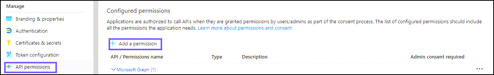
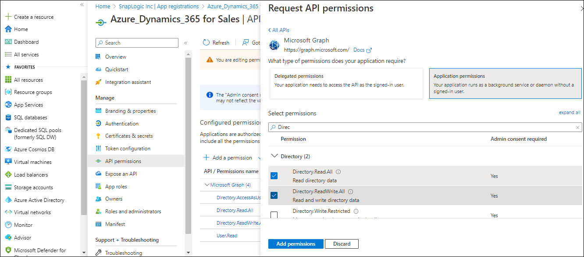
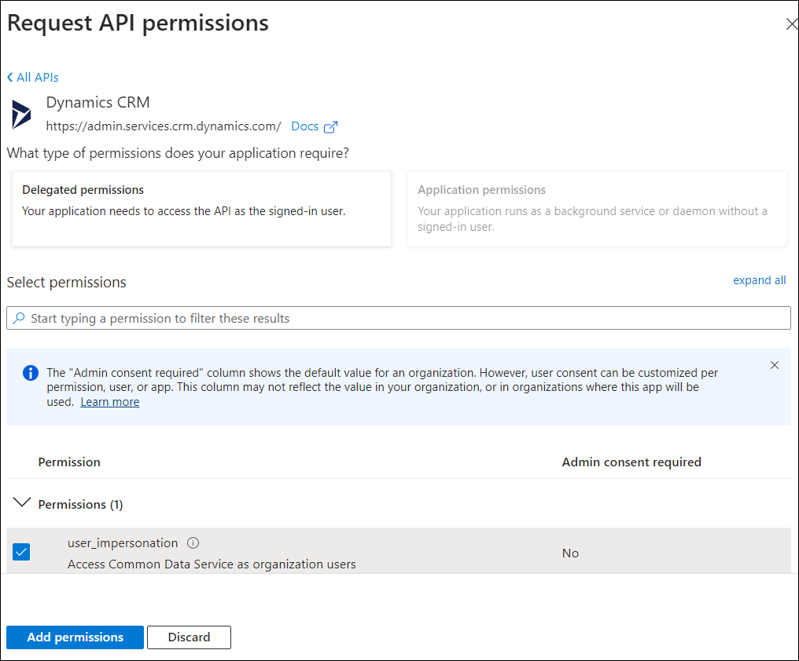
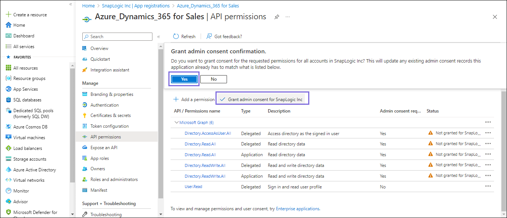
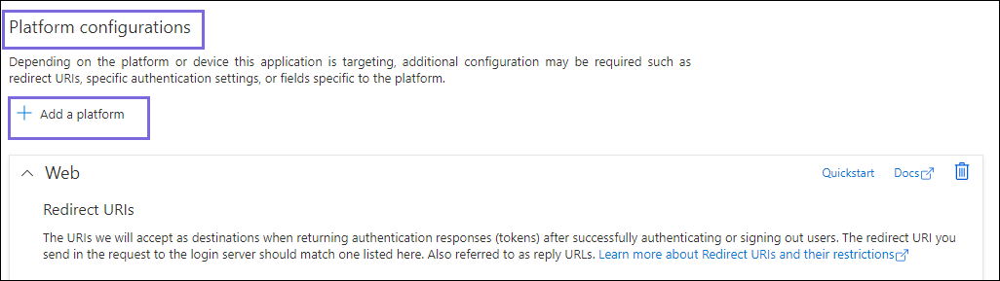
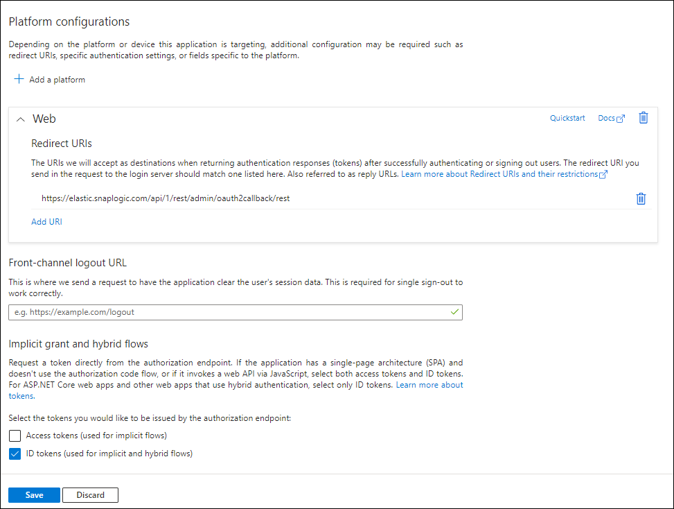

# Application Configuration in Azure Portal for OAuth2 Account

## Overview
This is an article about creating an Azure application for OAuth2 account to use in Dynamics 365. It discusses the prerequisites and steps to configure an application in the Azure portal. The application authenticates users and grants access to Dynamics 365.

## Key steps in the workflow
- [Create an application in the Azure portal](#create-an-application-in-the-azure-portal)
- [Define permissions](#define-permissions)
- [Locate the application credentials](#locate-the-application-credentials-in-the-azure-portal)
- [Specify the credentials and validate the Account](http://localhost:3000/Informational/OAuth2-configure#scopes-and-permissions-required-for-dynamics-365)

**Important points**
- An Azure account with a subscription is required.
- The application must have the following permissions: user.read.all and user.impersonation.
- The redirect URI is https://elastic.snaplogic.com/api/1/rest/admin/oauth2callback/rest.
- Troublshooting

** Key Steps in the Workflow** 

### Create an Application in the Azure Portal

Log in to the Microsoft Azure Portal(https://portal.azure.com/)

Navigate to **Azure services** > **Microsoft Entra ID**

Navigate to **Add** > **App registration**

On the **Register an application** page, specify the name for registering the application and click **Register**. Learn more about creating an application at [Quickstart: Register an app in the Microsoft identity platform - Microsoft Entra.](https://learn.microsoft.com/en-us/entra/identity-platform/quickstart-register-app)

>🎯To use an existing application, navigate to **Portal Home** > **Azure Active Directory** > **App registrations** > **All applications**. In the search box, specify the application name you want to use. Details on the application display in the search list.

## Define Permissions

1. On the left navigation panel, navigate to Manage, select API permissions > Add a permission.

2. On the Request API permissions window, select Microsoft Graph > Application permissions for the OAuth2 Application Account.

 
3. Select the permissions from Files, Users, and Teams. Choose the minimum API permissions listed under Scopes and Permissions Required for Dynamics 365.

4. Click Add Permissions. View all the permissions added under Configured permissions.

 
 

5. Click Grant admin consent confirmation and select Yes.

6. Click Overview and select Add a Redirect URI. You will be redirected to the Platform Configurations page. 

a. Under Platform configurations, click Add a platform.

b. Select Web and specify either of the following Redirect URIs based on the region your server is located:
https://elastic.snaplogic.com/api/1/rest/admin/oauth2callback/rest
https://emea.snaplogic.com/api/1/rest/admin/oauth2callback/rest

c. Click Configure. A popup message displays indicating that the application is successfully updated.

7. On the Platform configurations page, click Save. The Redirect URIs are added the the application.

 
## Locate the Application Credentials in the Azure Portal

To authorize your account in SnapLogic, you must have the following application credentials:

Application (Client) ID

Directory (Tenant) ID

Client secret value

On the application page, under Essentials, note the Application (client) ID and Directory (tenant) ID needed for the Snap account.

Open app_credentials.png
app_credentials.png
In the left navigation panel, select Manage > Certificates & secrets.

On the Certificates & secrets page, click + New client secret.

In the Add a client secret window, enter the Description, select an option for Expires from the dropdown list, and click Add. 

The Client secret value and ID are generated. This value and the ID are required to configure the OAuth2 account.

Open client_secret_value_with_blur_highlight.png
client_secret_value_with_blur_highlight.png
You can copy the Client secret value only after it is generated. Note that this value is displayed only once, so ensure to copy it securely.

## Scopes and Permissions Required for Dynamics 365
Application permissions

Permission

Display String

Description

Admin Consent Required?

user. impersonation

user_impersonation

Allows 
you to temporarily sign in as a different user in your network.

No

User.Read.All

User.Read.All

Allows the app to read the full set of profile properties, reports, and managers of other users in your organization, on behalf of the signed-in user.

Yes

## Specify the Credentials And Validate the Snap account
Navigate to the Snap of your choice and configure the OAuth2 account with the details from the Azure portal's registered application. Refer to Dynamics Directory OAuth2 account

Select the Auto-refresh token checkbox in the account settings and click Apply.

Click Authorize. The Access and Refresh tokens are generated. You will be redirected to the sign-in page of the Azure Portal.

Sign in to Azure Portal with valid credentials to redirect to the Snap Edit account settings dialog. The Access and Refresh tokens are autopopulated but encrypted in the Account settings.

Validate the Snap Account.

If you select the Auto-refresh token checkbox, then you must provide offline_access as the Scope in the Token end point configuration.

## Troubleshooting
|           Common Errors       |       Reason             |        Response        |
|:-------------------------------|:--------------------------|:------------------------|
|              Error 401        |   Token is invalid       |Provide a valid token and reauthorize the account.|
|The redirect URI specified does not match the reply URI configured for the application.|Incorrect redirect URI specified by user.|Add the following redirect_uri:https://elastic.snaplogic.com/api/1/rest/admin/oauth2callback/rest |
|URL error when invoking the operation|Ensure the tenant domain name is correct.|Ensure that Directory (tenant) ID noted from the application is in the correct format. Example: 2060aafa-89d9-423d-9514-eac46338ec05|