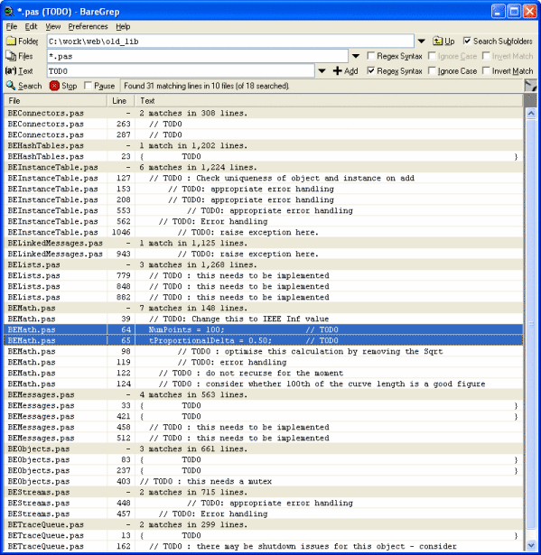

# Using the Grep Tool to Search Through Files

The grep tool is a powerful command-line utility used to search for patterns within text files. While the basic `grep` command is built into most Linux and Unix-like systems, there are other enhanced versions available as well.  BareGrep is one such tool that offers additional features and a graphical interface.

**How to Use BareGrep**

1. **Download BareGrep:**
   - Download Baregrep from [here](https://www.baremetalsoft.com/baregrep/download.php?p=m)
   
2. **Installation (if applicable):** 
   - **Windows:** BareGrep often comes as a standalone executable, so you might not need a full installation process. If an installer is provided, follow the on-screen instructions.
   - **Linux/macOS:** Installation may vary depending on your package manager. Consult the BareGrep documentation for specific instructions.

3. **Navigate to your target folder:**
     - **Using the graphical interface:** Most file managers allow you to right-click on a folder and choose an option like  "Open in Terminal" or "Open Terminal Here"
     
     - **Using the command line:**
        * Open your terminal or command prompt.
        * Use the `cd` command to change directories. Example: `cd /home/yourusername/Documents/ProjectFiles`

4. **Run BareGrep:**

```baregrep "search_pattern" .```

**Explanation:**
- `baregrep` : This is the command to execute BareGrep.
- `"search_pattern"`: Replace this with the actual word or phrase you want to search for.
- `*.*`: This tells BareGrep to search through all files in the current directory.

**Example:**

```baregrep "error" .```

**Additional Notes:**
* BareGrep offers a variety of options to customize your searches. Refer to the official documentation for advanced uses cases like regular expressions, case-sensitive searches, and more: [https://www.baremetalsoft.com/baregrep/](https://www.baremetalsoft.com/baregrep/) 
* There are alternative grep tools like ripgrep (rg) that are known for speed and additional features.