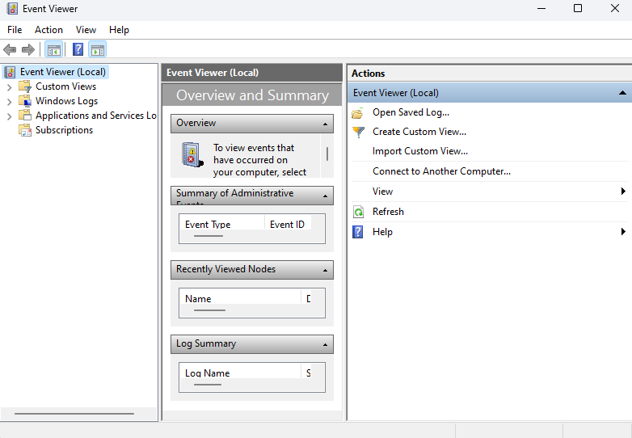

# Collecting Event Viewer Logs

This document outlines the steps for collecting Event Viewer logs relevant to D365 CE issues. These logs can provide valuable insights for troubleshooting and resolving various problems.

## Prerequisites:

Administrative access on the D365 CE server.

## Steps:

1. Open Event Viewer:

- Press the **Windows Key + R** to open the Run dialog.
- Type **eventvwr.msc** and press **Enter**.

2. Navigate to the desired log:

- Expand **Windows Logs** in the navigation pane on the left.
- Select the relevant log based on the issue you're troubleshooting. Common choices include:
**Application**: For application-specific events, including D365 CE related entries.
**System**: For system-wide events.
**Security**: For security-related events.

3. Filter the logs (optional):

- Right-click on the selected log and choose **Filter Current Log...**
- Define filter criteria such as Event level, Event source, or Date/Time. This can help narrow down the results to relevant events.

4. Save the logs:

- Right-click on the filtered (or unfiltered) log and select **Save All Events As...**
- Choose a descriptive filename and location for the saved log file.
- Select the desired format for the saved logs:
**EVTX**: Native Event Viewer format (recommended).
**XML**: Extensible Markup Language format.
**LEV**: Legacy format (less common).

## Additional Resources:

Microsoft documentation on Event Viewer: https://learn.microsoft.com/en-us/windows/win32/wes/windows-event-log-reference