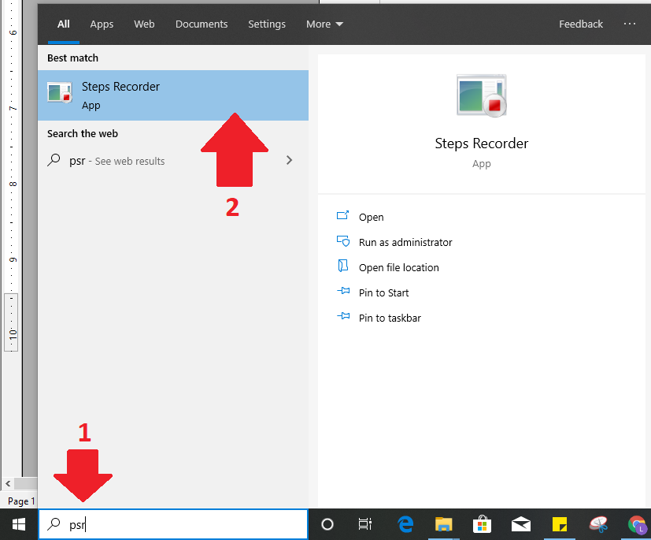
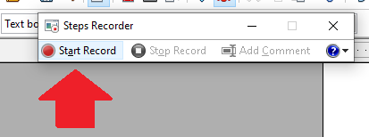
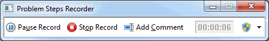

# Using the Windows Step Recorder -To record and save steps on your computer

1– Open Windows Steps Recorder by clicking the Start button of the Windows toolbar, and then typing psr. In the list of results, Click psr. and the Windows Steps Recorder will launch
​

2- Click Start Record. On your computer, go through the steps on your computer to reproduce the problem. You can pause the recording at any time, and then resume it later.
​​
You can highlight specific areas of the screen, and/or write comments (e.g. give information about a specific step of the workflow, state what you are trying to achieve, an abnormal/wrong result/behavior).
 
3 - Click Stop Record.
​​ 
4- In the Save As dialog box, type a name for the file,and then click Save (the file is saved with the .zip file name extension).
 
To view the record of the steps you recorded, open the .zip file you just saved, and then double-click the file. The document will open in your browser.
 
As you can see, it's very simple to use, and an excellent way of retrieving/provide information, that is essential to Technical Support or the person helping you, in order to investigate any issue.
 
To annotate a step

Once you are recording your workflow...
 
1 - When you want to add a comment, click Add Comment.

2 - Use your mouse to highlight the part of the screen you want to comment on, type your text in the Highlight Problem and Comment box, and then click OK.

To adjust Settings

When you adjust settings for Problem Steps Recorder, they are only saved for your current session. After you close and reopen Problem Steps Recorder, it will return to the default settings.

1 - Open Problem Steps Recorder. Click the Help down arrow, and then click Settings.

You can change the following settings:

Output Location -If you don't want to save a file after recording, click the Browse button to set a default output file name.

Enable Screen Capture- If you don't want to capture the screenshots along with the click information, Select No. (Please note that the capture of screenshots aggregated to the workflow, is one of the objectives of using this application. Clicking No, would defeat the purpose of using it.

Number of recent screen captures to store. While the default is 25 screens,you can increase or decrease the number of screenshots. Problem Step Recorder only records the default number of screenshots: For example,if you take 30 screenshots during a recording, but only had 25 screenshots as the default value, you would be missing the first five screenshots. In this case, you would want to increase the number of default screenshots.

Below is a quick demo of using PSR to capture opening of Github Desktop.
