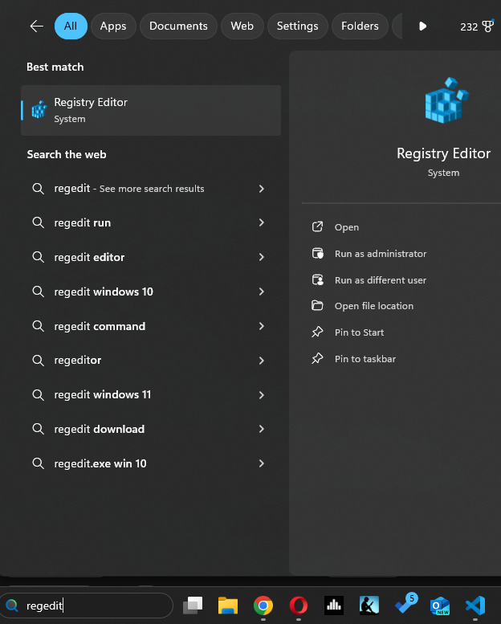
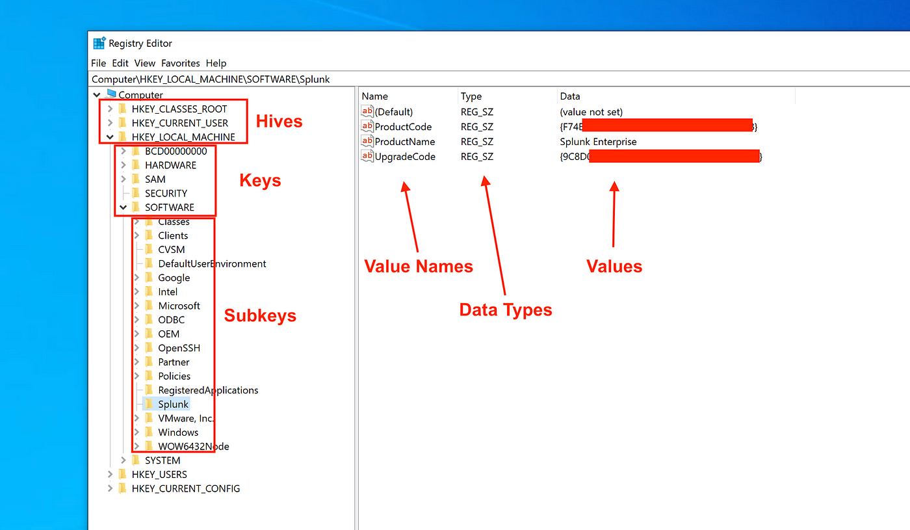
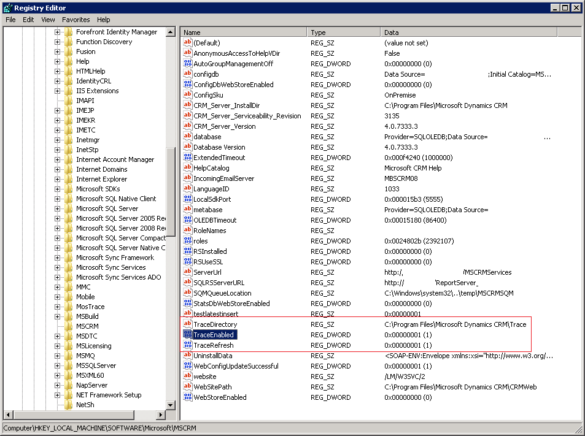

## Dynamics CRM Traces for On-Premise instances

Dynamics CRM traces are powerful debugging tools that provide detailed logs of system activities and events. 
This guide explains three methods for enabling and managing tracing.

**Prerequisites**

* Basic familiarity with your operating system (Windows).
* Understanding of Dynamics CRM concepts.
* Administrator privileges may be needed for certain actions.

**❗️Caution:** Changes to the registry can have unintended consequences. Create a backup before proceeding.

### Method 1: Using the Registry

* **Step 1:** Open the Registry Editor (Press Windows key + R, type 'regedit', and press Enter).


Know about the registry components here 
* **Step 2:** Navigate to the appropriate CRM registry key:
     * **CRM Server:** `HKEY_LOCAL_MACHINE -> SOFTWARE -> Microsoft -> MSCRM`
     
     

* **Step 3:** Create the following DWORD (32-bit) values:
    * `TraceEnabled`: Set to `1` to enable tracing.
    * `TraceDirectory`: Set to your desired log location (e.g., `C:\CRMLogs`).
    * `TraceRefresh`: Set to `99` (or any value) for changes to the above values to take effect.
    
* **Step 4:**  **Restart Services**: Reboot Dynamics CRM services or components to implement changes.

### Method 2: Using Deployment Properties 

* **Step 1:** Locate the Deployment Manager (`Microsoft.Crm.Deployment.exe`) in your Dynamics 365 Customer Engagement installation directory (`Server\bin`).
* **Step 2:** Right-click on `Microsoft.Crm.Deployment.exe` and select "Properties".
* **Step 3:** In the "Tracing" tab:
    * Check "Enable Deployment-Level Tracing".
    * Specify the "Log File Location".
    * Set the "Exception Trace Level".
* **Step 4:** Click "Apply" and "OK".

### **Method 3: PowerShell Scripts**

**Choosing the Right Method**:

- **For Basic Tracing**: Utilize CRM PowerShell cmdlets to swiftly enable/disable tracing and designate a log directory.
- **For Advanced Configuration**: Detailed scripts allow for intricate settings like call stack activation and nuanced logging levels.

### PowerShell Scripts for  Basic Tracing

**❗️Caution: The following script will write logs to "D:\crmtrace\logs\" Either create a folder at such location or update the location in script**

**Enabling CRM Tracing**:

```Powershell
Add-PSSnapin Microsoft.Crm.PowerShell
 
$setting = Get-CrmSetting TraceSettings
$setting.Enabled = $True
$setting.Directory = "D:\crmtrace\logs\"
 
Set-CrmSetting $setting
Get-CrmSetting TraceSettings
 
Write-Output "CRM Tracing ENABLED. Logs at: $($setting.Directory)"
```

**Disabling CRM Tracing**:

```Powershell
Add-PSSnapin Microsoft.Crm.PowerShell
 
$setting = Get-CrmSetting TraceSettings
$setting.Enabled = $False
 
Set-CrmSetting $setting
Get-CrmSetting TraceSettings
 
Write-OutPut "CRM Tracing DISABLED."
```

**Restarting CRM Services**:

```Powershell
get-service *mscrm* | restart-service
```

### **Accessing Trace Logs**

Logs will be available at the specified location. Review them with a text editor or log analysis tool.

### **Key Considerations**

- **Performance Impact**: Use tracing judiciously as it can affect system performance.
- **Data Sensitivity**: Handle logs carefully as they might contain sensitive data.

### PowerShell Scripts For Advanced Configuration in tracing, to capture CRM traces along with stack trace is as follows:

**💥 Back-up `web.config` file before proceeding** 

The script to be executed in powershell is:

```PowerShell
Param(
    [Parameter(Mandatory)]
    [string]$TraceFilePath = "C:\D365Logs",  # Default location

    [Parameter(Mandatory)]
    [ValidateSet("Verbose", "Information", "Warning", "Error", "Critical")]  
    [string]$LogLevel = "Verbose"
)

# Ensure trace file directory exists
if (!(Test-Path $TraceFilePath)) {
    New-Item -ItemType Directory -Path $TraceFilePath | Out-Null
}

# Construct the XML configuration section
$xmlConfig = @"
<system.diagnostics>
  <sources>
    <source name="Microsoft.Dynamics" switchValue="$LogLevel">
      <listeners>
        <add name="D365TraceListener" />
      </listeners>
    </source>
  </sources>
  <sharedListeners>
    <add name="D365TraceListener" 
         type="System.Diagnostics.TextWriterTraceListener" 
         initializeData="$TraceFilePath\D365Trace.log" 
         traceOutputOptions="ProcessId, DateTime, Callstack"/>
  </sharedListeners>
  <trace autoflush="true" />
</system.diagnostics>
"@

# Modify the web.config file of your D365 instance
# *** CAUTION:  Back up your existing web.config before proceeding ***

$webConfigPath = "C:\Path\To\Your\D365\web.config"  # Replace with the correct path
$xmlDoc = New-Object System.Xml.XmlDocument
$xmlDoc.Load($webConfigPath)

# Add/update the <system.diagnostics> section (if not already present)
$configSection = $xmlDoc.SelectSingleNode("configuration/system.diagnostics")
if (!$configSection) {
    $configSection = $xmlDoc.CreateElement("system.diagnostics")
    $xmlDoc.configuration.AppendChild($configSection)
}
$configSection.InnerXml = $xmlConfig

# Save the modified web.config
$xmlDoc.Save($webConfigPath)

Write-Host "D365 logging configuration updated. Log files will be written to: $TraceFilePath"
```
Explanation:

Parameters:

TraceFilePath: Allows you to specify the desired location for the log files. Defaults to "C:\D365Logs".
LogLevel: Controls the verbosity of logging. Valid options are:
"Verbose"
"Information"
"Warning"
"Error"
"Critical"
Directory Creation: Checks if the specified trace directory exists, creates it if necessary.

XML Configuration: Constructs the XML snippet needed to configure D365's logging. This includes settings for:

Log level
Log file path
Enabling call stack tracing
Web.config Modification:

Important: Before running this, make sure you have a backup of your D365's web.config file.
Loads the web.config file.
Adds or updates the `<system.diagnostics>` section with the constructed XML configuration.
Saves the changes to web.config.
How to Use:

Save as a .ps1 file (example: enable_d365_logging.ps1)
Open a PowerShell console (run as administrator).
Run the script:
```PowerShell
.\enable_d365_logging.ps1 -TraceFilePath "D:\MyLogs" -LogLevel "Information" 
```
Remember: You'll likely need to restart your D365 services for the logging changes to take effect.
### Retrieving Trace Logs

* Trace logs will be generated in the location you specified in either method. 
* Use a text editor or log analysis tool to review them.

**Important Considerations**

* **Performance:** Enabling tracing can impact performance. Disable it when not needed.
* **Data Sensitivity:** Logs may contain sensitive information. Exercise caution with their storage and usage.  

